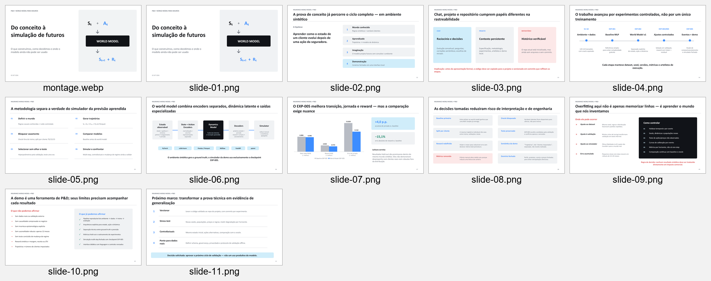

# Insurance World Model

Apresentação executiva de uma prova de conceito de **World Model aplicado a seguros**. O projeto explica como um modelo pode aprender a dinâmica entre o estado atual de um cliente, uma ação da seguradora e os possíveis estados futuros — permitindo comparar trajetórias simuladas em um ambiente sintético.

O repositório reúne o código-fonte completo da prova de conceito, os experimentos registrados, a interface local de simulação e uma apresentação executiva sobre o estudo.



## Objetivo

A hipótese investigada é que um modelo pode aprender como o estado de um cliente evolui após uma ação da seguradora:

```text
estado atual + ação → próximo estado + recompensa
     Sₜ       Aₜ          Sₜ₊₁          Rₜ
```

Diferentemente de um modelo preditivo clássico, que responde a uma pergunta isolada — como probabilidade de compra, fraude ou cancelamento —, um World Model aprende transições que podem ser encadeadas para projetar trajetórias e comparar ações ao longo do tempo.

## O que a apresentação aborda

- Diferença entre previsão clássica e simulação de um mundo.
- Metodologia para criar um ambiente sintético e gerar trajetórias.
- Preparação de transições no formato `Sₜ + Aₜ → Sₜ₊₁ + Rₜ`.
- Arquitetura com encoders de estado e ação, dinâmica latente e decoders especializados.
- Evolução experimental do baseline MLP ao World Model EXP-005.
- Métricas held-out de transição, jornada e recompensa.
- Riscos de overfitting ao dataset, à validação e ao próprio simulador.
- Limitações da prova de conceito e próximos passos para validação.

## Resultados apresentados

No ambiente sintético, o EXP-005 obteve:

- `6,596` de RMSE de próximo estado, contra `6,806` do baseline.
- `2,414` de MAE de recompensa, contra `2,845` do baseline — redução de aproximadamente `15,1%`.
- `9,122%` de erro de jornada, contra `13,039%` do baseline — ganho de aproximadamente `4,0` pontos percentuais em acurácia.

Esses números são evidências internas da prova de conceito. Eles não demonstram desempenho com clientes reais, causalidade de negócio ou robustez fora da distribuição sintética utilizada no treinamento.

## Estrutura do repositório

```text
.
├── api/                         # API FastAPI e interface do simulador
├── data/                        # Geração, contrato e preparação do dataset
├── environment/                 # Ambiente sintético e regras causais conhecidas
├── evaluation/                  # Avaliação e comparação de experimentos
├── model/                       # Encoders, baseline e World Model
├── simulation/                  # Rollouts e simulação multi-step
├── training/                    # Treinamento e otimização controlada
├── tests/                       # Testes automatizados
├── artifacts/                   # Métricas, checkpoints e metadados de execução
├── metodologia/                 # Documentação metodológica
├── PROJECT_SPEC.md              # Especificação técnica do projeto
├── EXPERIMENTS.md               # Histórico e decisões experimentais
├── requirements.txt
├── Insurance-World-Model-Apresentacao-Executiva-v2.pptx
├── Insurance-World-Model-Apresentacao-Executiva.pptx
├── *.pptx.inspect.ndjson
└── .deck-build/
    ├── build_deck.mjs
    ├── contact-sheet.png
    └── rendered/
        ├── montage.webp
        ├── slide-01.png ... slide-13.png
        └── slide-01.layout.json ... slide-13.layout.json
```

- **`environment/`**: ground truth sintético, separado dos dados observáveis usados pelo modelo.
- **`model/` e `training/`**: baseline MLP, arquitetura do World Model e rotinas experimentais.
- **`evaluation/` e `artifacts/`**: métricas held-out, checkpoints e rastreabilidade dos experimentos.
- **`api/` e `simulation/`**: simulador fechado que utiliza o checkpoint do EXP-005.
- **`Insurance-World-Model-Apresentacao-Executiva-v2.pptx`**: versão mais recente da apresentação.
- **`.deck-build/build_deck.mjs`**: código que constrói os 13 slides.
- **`.deck-build/contact-sheet.png`**: visão consolidada da apresentação.
- **`.deck-build/rendered/`**: renderizações individuais e dados de layout usados na validação visual.
- **`*.inspect.ndjson`**: relatórios estruturais gerados durante a inspeção dos arquivos PowerPoint.

## Instalação

Requer Python 3.11 ou versão compatível.

```powershell
python -m venv .venv
.\.venv\Scripts\Activate.ps1
pip install -r requirements.txt
```

## Fluxo do experimento

Gere as trajetórias sintéticas e execute os testes:

```powershell
python -m data.generate_dataset --customers 10000 --months 12 --seed 42 --output artifacts/insurance_trajectories.parquet
python -m data.visualize
pytest
```

Treine e avalie o baseline:

```powershell
python -m training.train --epochs 8
python -m evaluation.evaluate
```

Treine e avalie o World Model:

```powershell
python -m training.train_world_model --epochs 8
python -m evaluation.evaluate_world_model
python -m evaluation.compare_experiments
```

O EXP-005, usado pelo simulador, habilita heads auxiliares de compra e cancelamento:

```powershell
python -m training.train_world_model --artifact-dir artifacts/exp-005 --experiment-id EXP-005 --epochs 8 --latent-dim 64 --reward-loss huber --reward-loss-weight 1.25 --residual-numeric --event-heads --purchase-loss-weight 0.5 --cancellation-loss-weight 0.5
```

Consulte [`EXPERIMENTS.md`](EXPERIMENTS.md) para o histórico completo, incluindo tuning controlado e EXP-004.

## Simulador local

```powershell
python -m uvicorn api.app:app --reload
```

Acesse `http://127.0.0.1:8000`. A interface simula múltiplas trajetórias possíveis para um mesmo perfil configurado. Os resultados são previsões experimentais, não clientes impactados, cotações ou resultados reais.

## Como regenerar a apresentação

O deck foi criado em JavaScript com `@oai/artifact-tool`.

1. Instale o Node.js e disponibilize `@oai/artifact-tool` no ambiente.
2. Abra [`.deck-build/build_deck.mjs`](.deck-build/build_deck.mjs).
3. Atualize as constantes `OUT`, `RENDER` e `SRC` no início do arquivo para caminhos válidos na sua máquina.
4. Execute:

```bash
node .deck-build/build_deck.mjs
```

O script gera o PowerPoint, imagens PNG de cada slide, arquivos JSON de layout e uma montagem em WebP.

> O caminho `SRC` referencia os artefatos do estudo original usados nas notas e na rastreabilidade da apresentação. Para uma reprodução completa, esses arquivos precisam existir localmente ou as referências devem ser adaptadas.

## Limitações

- O ambiente, os dados e as recompensas são sintéticos.
- Não há validação externa ou com dados reais neste repositório.
- O estudo não comprova causalidade nem impacto comercial.
- A recompensa sintética não deve ser interpretada como receita, margem ou LTV.
- Pequenos erros de previsão podem se acumular em simulações de vários passos.
- Perfis, produtos, canais, preços e horizontes foram mantidos em domínio fechado.

## Próximos passos

- Executar testes com novas seeds, populações, preços e regras.
- Avaliar degradação das métricas por horizonte de simulação.
- Comparar ações alternativas a partir do mesmo estado inicial usando o oracle sintético.
- Definir schema, governança, privacidade e protocolo de validação para dados reais.
- Preparar uma ponte controlada entre o ambiente sintético e dados operacionais reais.

## Uso responsável

Este material é uma demonstração de pesquisa e desenvolvimento. Nenhum resultado sintético deve ser convertido diretamente em decisão sobre clientes, preço, subscrição, oferta ou impacto financeiro.
